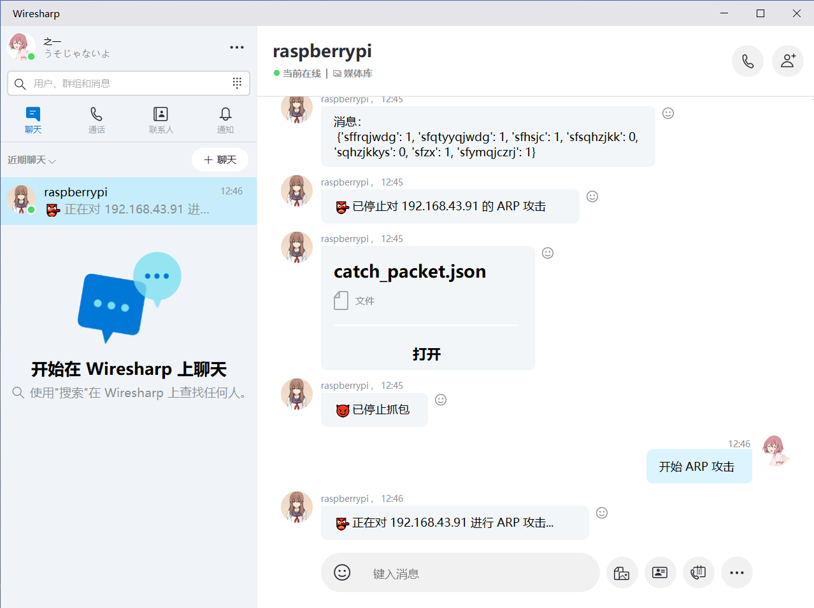
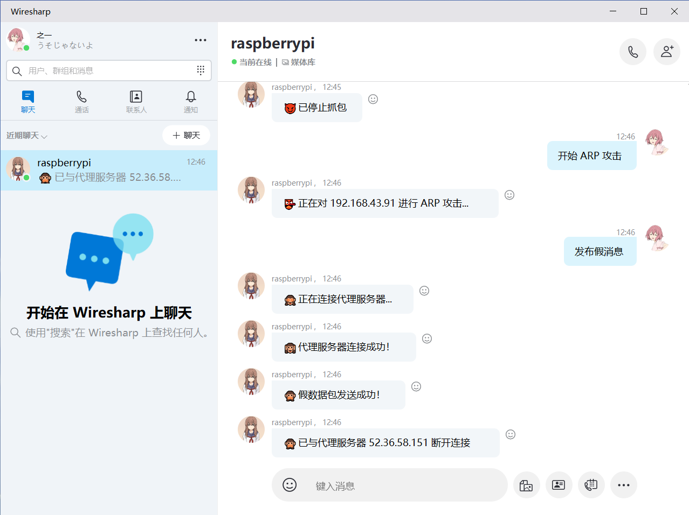

# Wiresharp
Start chat♂ting in Wiresharp

## Screenshot
* Catch Packet

* ARP Attack

* Recurrence Attack

* Funny talk

## Coding Environment
* Python 3.8.6 64-bit
* pyqt5 5.13.2
* MSVC

**NOTE: MSVC is necessary to load the dll.**